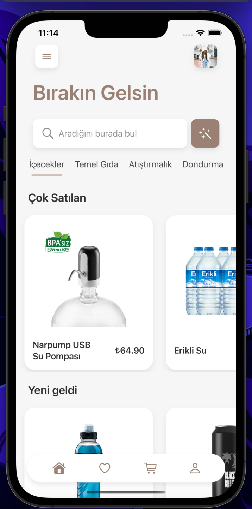
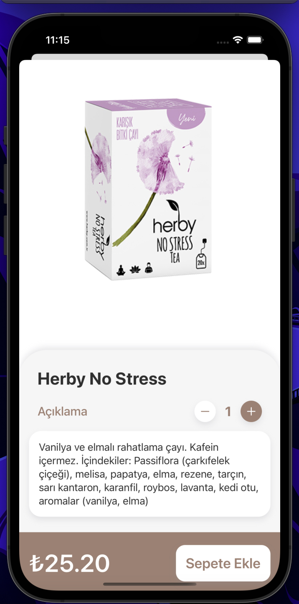
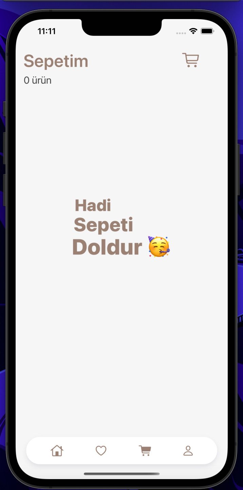

# Shopping App
PS: Code files are removed. Only images and info to showcase the app.
An online shopping app where you can search and scroll through different products or categories. 

- You can select a product to view details and price. Double clicking the product image will add it to your wishlist! 
- If you switch to "My Cart" tab from the bottom tab view, i've added a cute little cart animation as a cherry on top.
- Looking at the top left corner, there's a cart items count and if your cart is empty, once again a beautiful animation is ready to pop. 

**Note:** The color palette is inspired by an Instagram post.
 
## Architecture
- SwiftUI and MVVM
- Position, Rotation, Scale, and Hue Animations
- **Custom** Tab Bar 
- Vertical and Horizontal ScrollViews, Lazy Stacks and Custom Components
- Sheets
- Custom Model Presentation and KingFisher Asynchronous Image Management 
- Smooth Opacity and Slide Transitions

## Concept

  
  
  

